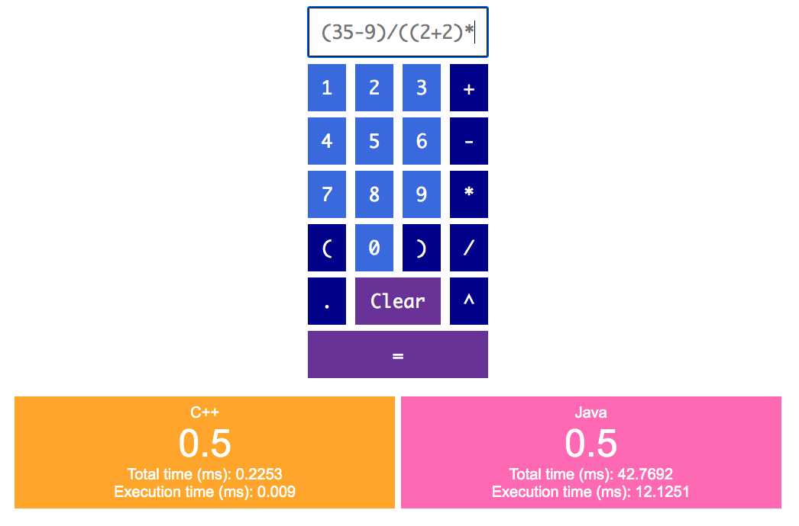

# The Polyglot Calculator

# Project Summary

### What is the overall goal of the project (i.e. what does it do, or what problem is it solving)?
The Polyglot Calculator is a webapp where a user can explore the differences in how programming languages perform mathematical calculations. It displays the results of the same mathematical calculation executed by C++ and Java. It also compares their time performance.

### Which languages did you use, and what parts of the system are implemented in each?
The frontend is written using **JavaScript**, HTML, and CSS; it is built on the Django framework (which is **Python** based). The languages in the backend that execute the user-inputted mathematical calculation are **C++** and **Java**.

### What methods did you use to communicate between languages?
The Django framework handles the communication between Python and JavaScript/HTML/CSS. Python communicates with C++ via the Python module `ctypes`, which is a foreign function interface. Python communicates with Java via the RabbitMQ messaging system.

### Exactly what steps should be taken to get the project working, after getting your code? 
1. Ensure that Docker is running on your machine. Opening the Docker GUI should do the trick.
2. From the root of the project directory, run: `./prod_files/create_calculator.sh`
    - If you see `ERROR: Couldn't connect to Docker daemon.` return to step 1.
    - This script starts 3 Docker containers (RabbitMQ, Java, Django/C++) and creates a Docker volume where the logs for the messaging service get dumped.
    - While the script is running, it may display errors from both the Java container and the Django container. This is normal. The Docker configurations are set such that it will keep retrying to start the Django and Java containers until the messaging container is ready to accept a connection.
    - When the script has finished and the Docker containers are set up, you will see `calculator-java_1      |  [x] Awaiting RPC requests`.
2. View The Polyglot Calculator at: http://127.0.0.1:8000/
    - If you don't see the calculator, step 2 may not have finished yet.

### What features should we be looking for when marking your project?
The Polyglot Calculator can do the following:
- Parse (Shunting-Yard algorithm) and evaluate (postfix notation) user-inputted BEDMAS expressions (exponentiation, division, multiplication, addition, subtraction). For example: `(35-9) / ((2+2) * 13)`.
- Support decimal inputs. For example: `3.1 + 4.2`.
- Support negative numbers when inputted with parentheses. For example: `(-4) + 8`.
- Display an error message when the user's input is not valid.
- Display the results of the mathematical calculations as performed by both C++ and Java.
- Display the *total time* it took for Python to make an FFI call to C++ and get the result.
- Display the *total time* it took for Python to send a message to Java via RabbitMQ and get the result.
- Display the *execution times* of C++ and Java (*excludes* the FFI calls, RabbitMQ messaging, and wrapper Python logic).
- Provide a nice UX: colourful and thoughtfully laid out UI, both keyboard and button click inputs, focus is always set to the calculator input, show the last expression evaluated even after executed.

### References:
- Python Shunting Yard algorithm and postfix evaluation adapted from: http://www.martinbroadhurst.com/shunting-yard-algorithm-in-python.html
- RabbitMQ Java RPC server code adapted from: https://github.com/rabbitmq/rabbitmq-tutorials/blob/master/java/RPCServer.java
- RabbitMQ Python client code adapted from: https://github.com/rabbitmq/rabbitmq-tutorials/blob/master/python/rpc_client.py
- Using ctypes in Python to call C++ functions code adapted from: https://nesi.github.io/perf-training/python-scatter/ctypes

